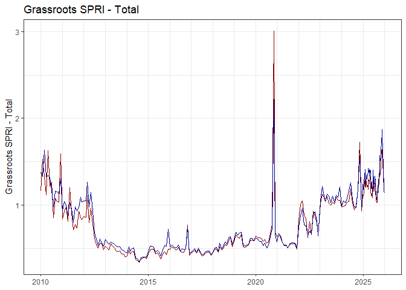
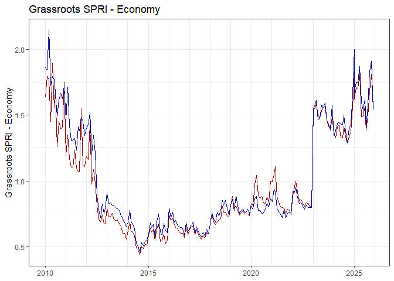
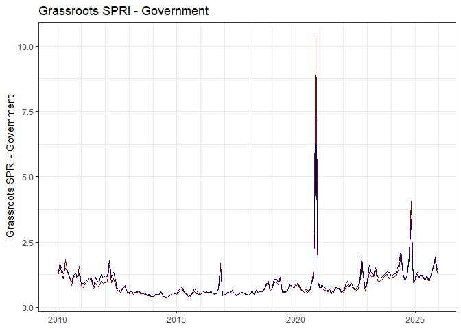
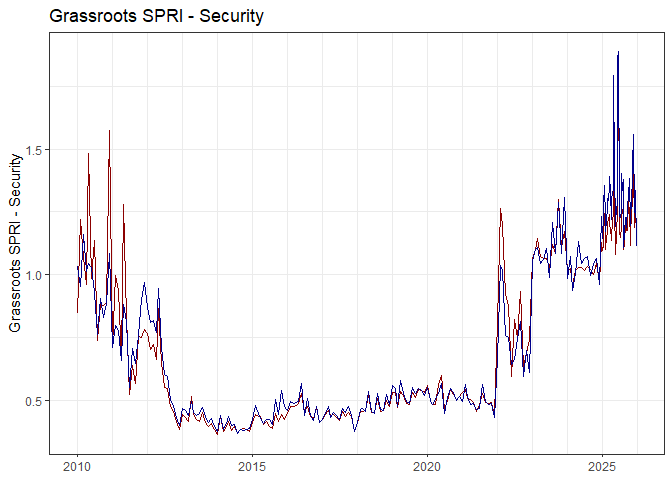
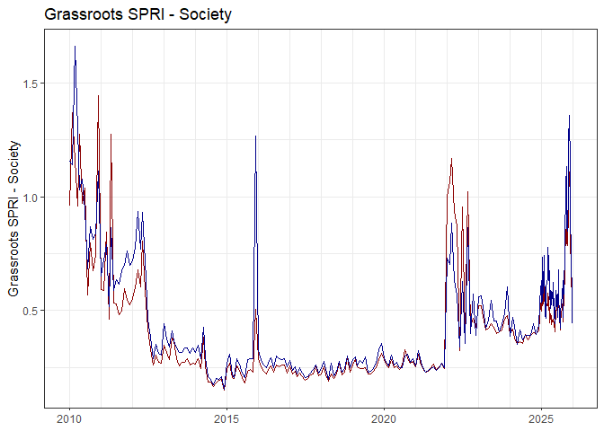
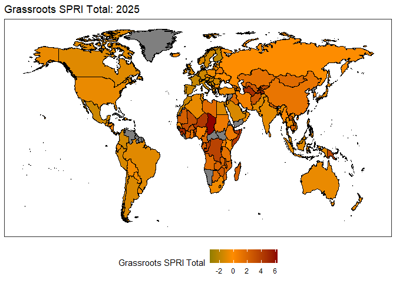

# globaltrends SPRI

We propose a concept of grassroots socio-political risk (SPR) and
provide the **globaltrends SPRI** as a measure. The **globaltrends
SPRI** is based on individual-level issue salience using data from
[Google Trends](https://trends.google.com/trends/). Our concept provides
a bottom-up complement to established measures that focus more on
political institutional players and the institutional constraints they
face. The **globaltrends SPRI** can serve to predict institutional
change in a country initiated by a popular majority of individuals. In
contrast to existing measures, the **globaltrends SPRI** measure
captures issue salience directly among individuals rather than media or
analyst reports. As such, it is uniquely representative of
socio-political sentiment, timely, and widely available. Our concept and
measure offer novel opportunities for international business
researchers. Refer to the accompanying paper (available from the
authors) for further information on the index construction.

The current version of the **globaltrends SPRI** dataset can be accessed
in differnet file formats:

- [PARQUET](https://github.com/ha-pu/globaltrends_spri/blob/main/data_spri.parquet)
- [RDS](https://github.com/ha-pu/globaltrends_spri/blob/main/data_spri.rds)
- [XLSX](https://github.com/ha-pu/globaltrends_spri/blob/main/data_spri.xlsx)

Cite any usage of the **globaltrends SPRI** as:  
Puhr, H., & Müllner, J. (2023). Vox Populi, Vox Dei: A Concept and
Measure for Grassroots Socio-Political Risk Using Google Trends.
*Journal of International Management*, 30(2): 101096.
<https://doi.org/10.1016/j.intman.2023.101096>

The **globaltrends SPRI** is part of the [globaltrends
project](https://github.com/ha-pu/globaltrends).

- Last update of the data: 2026-01-07
- Coverage of the data: 2010-2025

## Development of Global SPRI

## Global SPRI 2010 vs. 2025

