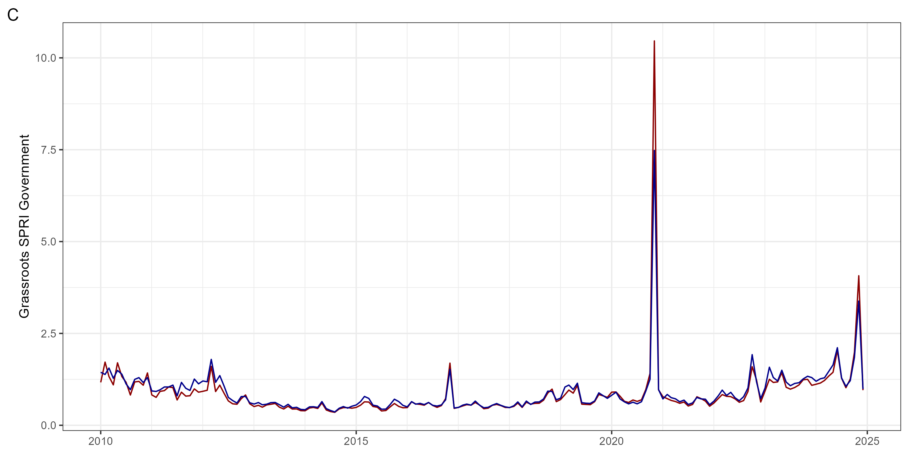
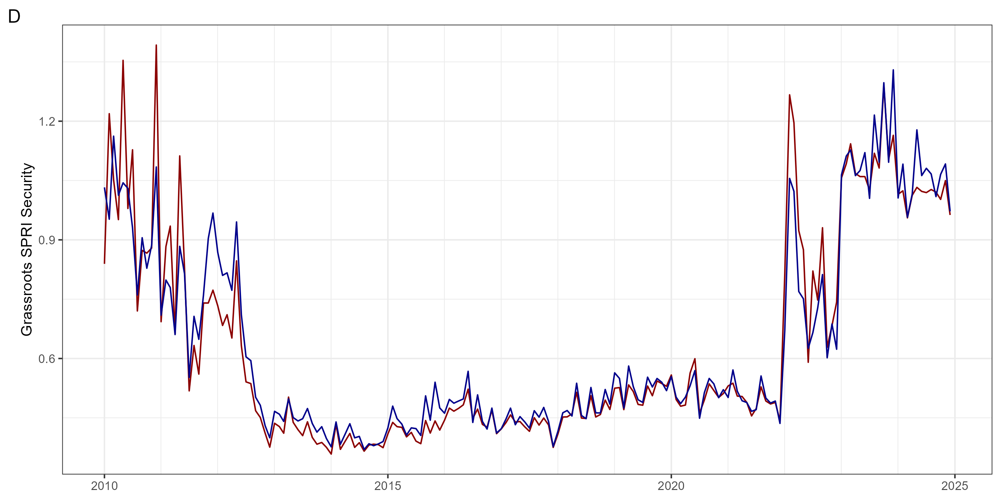
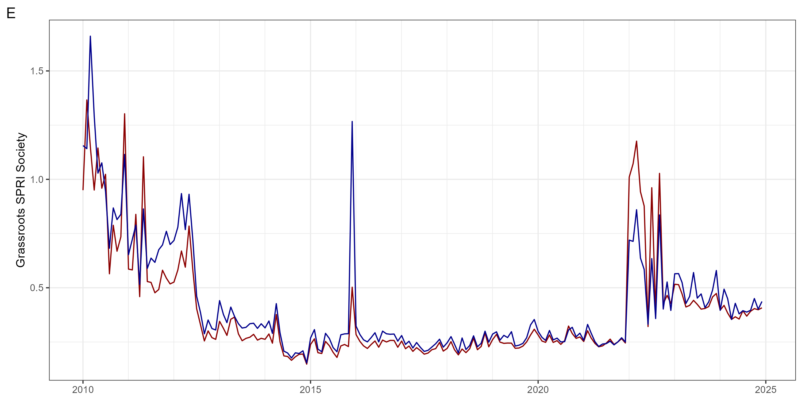

# globaltrends SPRI
 A Google Trends-Based Socio-Political Risk Measure

We propose a concept of grassroots socio-political risk (SPR) and provide a the **globaltrends SPRI** as a measure for it. The **globaltrends SPRI** is based on individual-level issue salience using data from [Google Trends](https://trends.google.com/trends/). Our concept provides a bottom-up complement to established measures that focus more on political institutional players and the institutional constraints they face. The **globaltrends SPRI** can serve to predict institutional change in a country initiated by a popular majority of individuals. In contrast to existing measures, the **globaltrends SPRI** measure captures issue salience directly among individuals rather than media or analyst reports. As such, it is uniquely representative of socio-political sentiment, timely, and widely available. Our concept and measure offer novel opportunities for international business researchers. Refer to the accompanying [paper](add link) published in *Journal of International Management* for further information on the index construction.

The current version of the **globaltrends SPRI** dataset can be accessed [here](https://github.com/ha-pu/globaltrends_spri/blob/main/data_spri.xlsx). Cite any usage of the **globaltrends SPRI** as:  
Puhr, H., & Müllner, J. (forthcoming). Vox Populi, Vox Dei: A Concept and Measure for Grassroots Socio-Political Risk Using Google Trends. *Journal of International Management*. [DOI](add link).

The **globaltrends SPRI** is part of the [globaltrends project](https://github.com/ha-pu/globaltrends).

* Last update of the data: 2023-07-14.
* Coverage of the data: 2010-2022

## Development of Global SPRI

  
  
  
  
  

## Global SPRI 2010 vs. 2022

  
  

