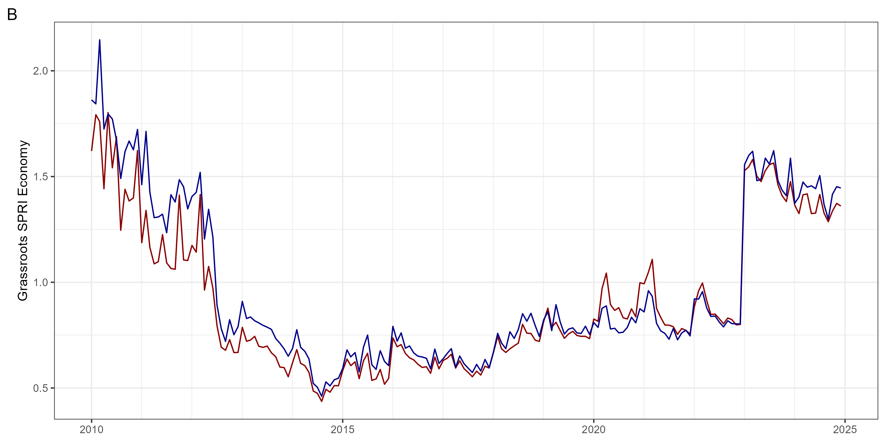
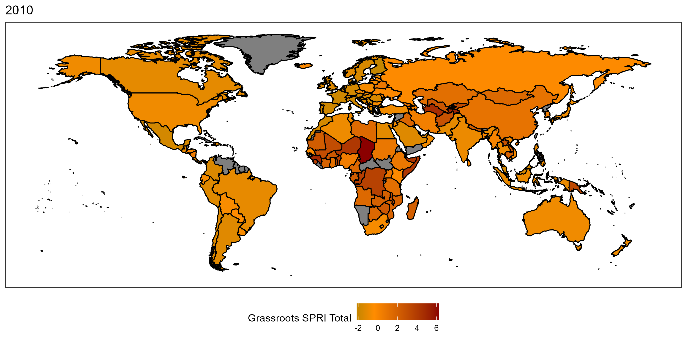

# globaltrends SPRI
 A Google Trends-Based Socio-Political Risk Measure

* Last update of the data: 2023-07-14.
* Coverage of the data: 2010-2022

The current version of the globaltrends SPRI dataset can be accessed [here](https://github.com/ha-pu/globaltrends_spri/blob/main/data_spri.xlsx).

  
  
  
  
  

  
  

